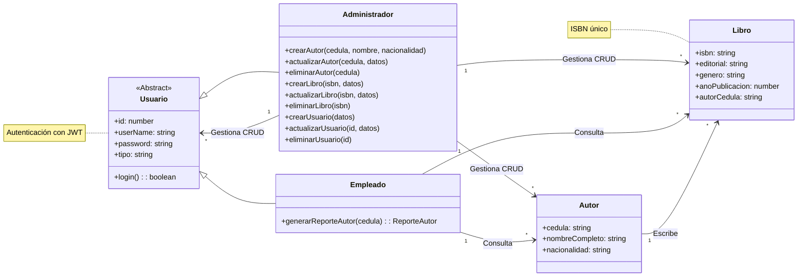
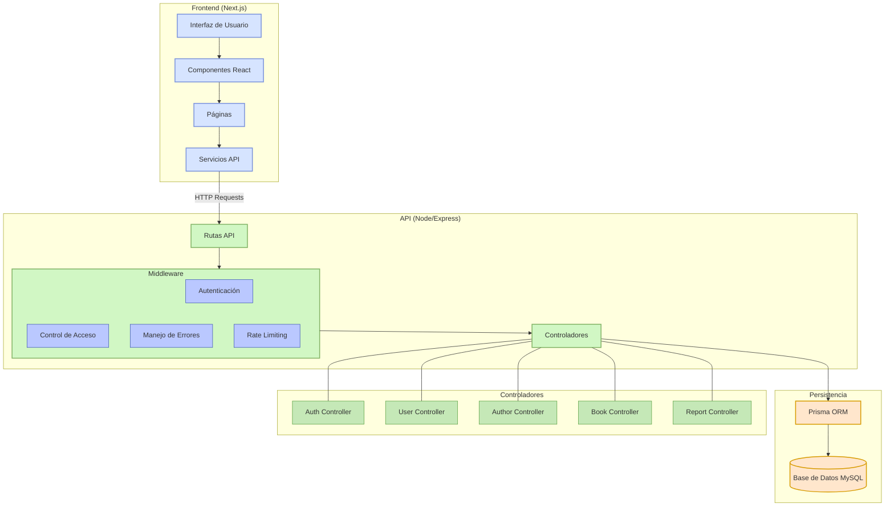

# Biblioteca Municipal API


Sistema para gestión de bibliotecas con seguimiento de relaciones entre libros, autores y usuarios. Combina API REST tradicional con endpoints GraphQL para casos específicos de alto rendimiento.

# 📚 Diagrama de Clases


A continuación se muestra el diagrama de clases del sistema:


# 📚La aplicación sigue una arquitectura de capas claramente definida:





## Características

### Backend 
- Autenticación basada en JWT
- Gestión de roles (administrador y empleado)
- CRUD completo para autores, libros y usuarios
- Generación de reportes
- Documentación completa de endpoints : [Aqui](https://docs.google.com/document/d/1I-r1KHZBm6ZxHvHGeeV8F5-v5n1i-smFPe9R8aJvb4s/edit?tab=t.0)

## Tecnologías

- Node.js & Express
- Prisma ORM
- MySQL
- JWT

## Instalación

1. Clonar el repositorio
 ```bash
   git clone https://github.com/tuusuario/biblioteca-municipal-api.git
   cd backend
```
2. Instalar dependencias
```bash
 npm install
```
3. Configurar variables de entorno
```bash

DATABASE_URL="mysql://usuario@localhost:puerto/base_de_datos"

#environment
NODE_ENV="development"

# JWT Variables
JWT_SECRET="secret"
JWT_EXPIRES_IN="1d"

# Server
PORT=

```

4. Ejecutar migraciones de la base de datos
```bash
  npx prisma migrate dev
  npx prisma studio

```
5. Iniciar el servidor
```bash
   npm run dev
```


#  Patrones de Diseño Implementados
## - Patrón MVC (Modelo-Vista-Controlador)

El sistema implementa el patrón MVC, separando claramente:

Modelo: Definido mediante esquemas Prisma para las entidades Autor, Libro y Usuario
Vista: Componentes React en el frontend
Controlador: Express Controllers que manejan las peticiones HTTP


## Patron Singleton
#### Para asegurarnos de que la base de datos solo tenga una sola instancia 
```bash 
//database/db.js
const { PrismaClient } = require("@prisma/client");
const { NODE_ENV } = require("../config/env");

class Database {
    constructor() {
        if (!Database.instance) {
            try {
                Database.instance = new PrismaClient();
                console.log(`✅ Conectado a la base de datos en modo ${NODE_ENV}.`);
            } catch (error) {
                console.error("❌ Error al conectar con la base de datos:", error);
                process.exit(1);
            }
        }
    }

    getInstance() {
        return Database.instance;
    }
}

module.exports = new Database().getInstance();
```

# Autenticación de Usuarios (8 puntos)

Sistema de autenticación basado en JWT
Almacenamiento seguro de tokens en localStorage
Manejo de roles mediante middlewares


